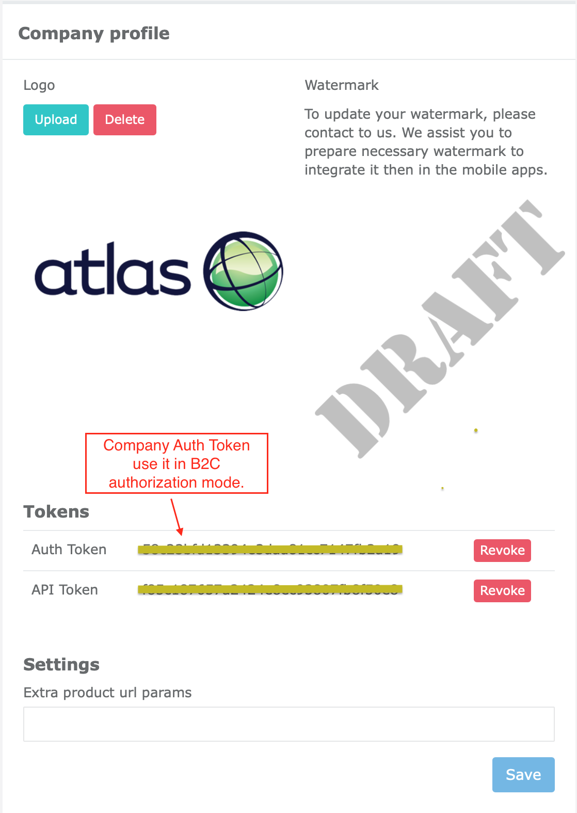
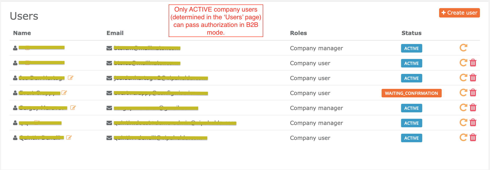

# ConfigWiseSDK (iOS)

This repository contains iOS project (code examples) to explain how to use ConfigWiseSDK.
See more info about ConfigWise service, here: [https://www.configwise.io](https://www.configwise.io)  

ConfigWiseSDK (iOS) is distributed through Cocoapods.

The current repository also contains latest version of [ConfigWiseSDK.zip](ConfigWiseSDK.zip) packaged framework.
You can use it to setup framework in your project in case if you don't use Cocoapods.

The ConfigWiseSDK (iOS) is based on Apple ARKit / SceneKit stack underhood.
The architectural design of ConfigWiseSDK hides all boilerplate stuff (of ARKit, SceneKit).
It gives simple way of working with AR and 3D experience in your own iOS applications.

# License

ConfigWiseSDK framework is distributed under [Apache-2.0](LICENSE) license.

# Prerequisites

ConfigWiseSDK requires the following minimal requirements:

1. Real iPhone (iPad) with installed iOS v12.0 and above.
**NOTICE:** Unfortunately, AR (augmented reality) doesn't work on simulator.
So, if you plan to use `ArAdapter` of ConfigWiseSDK then make sure you run / debug your project on real iPhone (iPad). 
2. Xcode v11.X
3. Cocoapods v1.9.X and above
4. Swift 4.2 and above (we recommend to use Swift 5)
5. If you run your project on real device with installed iOS v13.3.1 and above and if you use FREE 'personal team' as a apple development program,
then please upgrade your apple plan to use paid 'personal team', otherwise it's known apple issue if you run your app on real iPhone (iPad).
See the following links for more details about this issue:
    - https://stackoverflow.com/questions/60015309/running-ios-apps-causes-runtime-error-for-frameworks-code-signature-invalid
    - https://github.com/Alamofire/Alamofire/issues/3051
    - https://github.com/NativeScript/NativeScript/issues/8294
    - https://github.com/flutter/flutter/issues/49504

# Installation

1. Add the following lines to your `Podfile`:

        pod 'ConfigWiseSDK'

2. Then, you also need to add the following properties in the `Info.plist` file.
These settings are required for AR usage - to permit your application to access to camera, photos of your phone. 

        <key>NSCameraUsageDescription</key>
        <string>To enable Augmented Reality user experience.</string>
        
        <key>NSPhotoLibraryAddUsageDescription</key>
        <string>To be able to save images.</string>
        
        <key>NSPhotoLibraryUsageDescription</key>
        <string>To be able to attach images.</string>

3. Finally, add [NodeRender.metal](examples/ios-example/ios-example/NodeRender.metal) file to your project (as `metal` source code).
`NodeRender.metal` is [Apple Metal API](https://developer.apple.com/metal/) based code to show 'glow' visualisation of highlighted 3D objects in the scene.
Unfortunately, there are some known issues (restrictions) to pack `.metal` code inside of ConfigWiseSDK framework - that's why `.metal` code must 
be part of your project to pass compilation steps.  

# Tutorial

Make sure to watch this tutorial provided by Rebeloper.

# Quick start

Examples of code are also distributed here. It is good point to quick start - to get experience of ConfigWiseSDK usage.

Examples project requires:

1. Xcode v11.3.1
2. Swift 5
3. SwiftUI
4. [ConfigWise account](https://manage.configwise.io)

Let's download and install ConfigWiseSDK (iOS) framework:

    $ cd examples; pod install

Then, let's open `examples/examples.xcworkspace` in your Xcode.

Set your `COMPANY_AUTH_TOKEN` in the `ios-example/AppEnvironment.swift` file (see this token in the CBO).   

        var mode: SdkVariant {
            .B2C
        }
        
        init() {
            // Let's initialize ConfigWiseSDK here
            ConfigWiseSDK.initialize([
                .variant: self.mode,
                .companyAuthToken: "YOUR_COMPANY_AUTH_TOKEN",
                .dbAccessPeriod: 1 * 60 * 60, // (sec) 1 hr
                .lightEstimateEnabled: true,
                .debugLogging: true,
                .debug3d: false
            ])
            . . .
        }
        
There are 2 authorization modes supported by ConfigWiseSDK:

- B2C (`COMPANY_AUTH_TOKEN` is required) - use this method if you NO need ConfigWise users SignIn flow.
Eg: to provide public access to your application or if if you want to use own authorization flow.

    To obtain `COMPANY_AUTH_TOKEN`, go to `CBO (company back office) > Company profile`: [https://manage.configwise.io/configwise/cbo/profile](https://manage.configwise.io/configwise/cbo/profile)
    
    

- B2B (ConfigWise user credentials are required) - use this method to only permit registered ConfigWise users 
of your company to access to your mobile application. This method requires to type `email/password` by your company users
to access backend data. To manage your company users, go to `CBO > Users`: [https://manage.configwise.io/configwise/cbo/employees](https://manage.configwise.io/configwise/cbo/employees)

    

    To use `B2B` mode - change `SdkVariant` to `.B2B` mode in the `ios-example/AppEnvironment.swift` file.
    
            var mode: SdkVariant {
                .B2B
            }

So, we are ready to build and run example project - make sure `ios-example` scheme in selected in Xcode.
Connect your iPhone (iPad) - choose you device in the 'device selector' of Xcode IDE. 
Then press 'Build & Run' button in the Xcode.

**NOTICE:** Example project is SwiftUI based. But all things (what we describe below) are also compatible 
with UIKit based projects as well.

## ConfigWiseSDK initialization

Before using ConfigWiseSDK in your code, you need to initialize it first. Here is an example of code how to do this:

    import ConfigWiseSDK
    
    . . .
    
    ConfigWiseSDK.initialize([
        
        .variant: SdkVariant.B2C,                      // (mandatory) .B2B | .B2C - see details about these modes above.
        
        .companyAuthToken: "abcdef...12345",           // (optional) COMPANY_AUTH_TOKEN - this token required only in B2C mode, 
                                                       // skip it if you use B2B variant of initialization.
                                                       // You can obtain auth token in CBO > Company profile (see details above).
                                                       
        .dbAccessPeriod: 1 * 60 * 60,                  // (optional) 1 hr (3600 sec) by default - number of seconds, period while 
                                                       // app uses locally cached DB data (instead to request it from server).
        
        .lightEstimateEnabled: true,                   // (optional, true by default) If true then Light stimate mode is enabled in 
                                                       // the AR session (light estimate works based on real environment light sources).
        
        .debugLogging: false,                          // (optional) false by default.
                                                       // true - prints DEBUG, INFO, WARNING and ERROR messages in the log output
                                                       //        (useful for Debug build variants of your application).
                                                       // false - prints only WARNING and ERROR messages in log output.
                                                       //         (use it in Release build of your application).
        
        .debug3d: false                                // (optional) false by default.
                                                       // true - shows extra DEBUG visualisations in 3D and AR scenes
                                                       //        (such as bounding boxes, lights sources, detected AR ancors, 
                                                       //        planes, geometries, number of fps, etc).
                                                       // false - no extra DEBUG visualisations shown in the scenes.
                                                       //         Use it in Release build of your application.
        
        .localCachingOfModelsConvertedByAssimp: false  // (experimental, optional) false by default.
                                                       // ConfigWiseSDK (iOS) can load different formats of 3D files on runtime
                                                       // (eg: fbx, dae, gltf, glb, etc). On runtime SDK automatically converts 
                                                       // these files to Apple .scn format (compatible with SceneKit, ARKit).
                                                       // If your uploaded 3D files includes complecated geometries, materials, lights, reflection settings, etc.
                                                       // Then runtime conversion intensively uses your CPU, memory and your battery on runtime (what might be 
                                                       // critical for mobile apps, especially battery usage). 
                                                       // Well, if you set this flag to 'true' then SDK uses local caching of converted .scn files.
                                                       // This means, if you try to load (previously requested file), then conversion step will be skipped.
                                                       // In this case SDK looks for cached .scn (previously converted) version of your 3D file and returns it.
                                                       // If you set this flag to 'false' - then SDK always repeats conversion to .scn, even if you request previously 
                                                       // opened 3D file (no caching of converted files in this case).
                                                       // NOTICE: this feature is experimental at this moment. Currently, we recommend to set this flag to 'false'.
                                                       //         This feature will get stable in further ConfigWoseSDK releases.
    ])

In SwiftUI based projects, we recommend to initialize ConfigWiseSDK in the constructor of class what you inject as `environmentObject` then.
See [AppEnvironment.init()](examples/ios-example/ios-example/AppEnvironment.swift):

    var mode: SdkVariant {
        .B2C
    }
            
    init() {
        // Let's initialize ConfigWiseSDK here
        ConfigWiseSDK.initialize([
            .variant: self.mode,
            .companyAuthToken: "YOUR_COMPANY_AUTH_TOKEN",
            .debugLogging: true,
            .debug3d: false
        ])
        
        . . .
        
    }

To inject this initialization (in to SwiftUI life cycle), add `lazy var appEnvironment = AppEnvironment()` as a property of
`SceneDelegate.swift`. Then register `appEnvironment` as `environmentObject`:

    class SceneDelegate: UIResponder, UIWindowSceneDelegate {
    
        lazy var appEnvironment = AppEnvironment()
    
        func scene(_ scene: UIScene, willConnectTo session: UISceneSession, options connectionOptions: UIScene.ConnectionOptions) {
            
            . . .
            
            let contentView = ContentView()
                .environmentObject(self.appEnvironment)

            . . .
        }

See our example of [SceneDelegate.swift](examples/ios-example/ios-example/SceneDelegate.swift)

## Authorization

To access to data of ConfigWise service, application must be authorized first.

ConfigWiseSDK provides `AuthService.sharedInstance` with the following public functions:

- `signIn()` - use this function to pass authorization (supports two modes: B2B and B2C)

- `signOut()` - sign out from currently authorizes session.

- `currentUser()` - returns currently authorized user. The following users roles are used in ConfigWise:

    + `ROLE_COMPANY_MANAGER` - B2B company manager user.
    
    + `ROLE_COMPANY_EMPLOYEE` - B2B company employee user.
    
    + `ROLE_COMPANY_AUTH_TOKEN` - B2C company auth token. 

- `currentCompany()` - returns company of currently authorized user.

- `isCurrentUserCompanyManager()` - returns true if role of currently authorized user is `ROLE_COMPANY_MANAGER`.

- `isCurrentUserCompanyEmployee()` - returns true if role of currently authorized user is `ROLE_COMPANY_EMPLOYEE`.

- `isCurrentUserCompanyAuthToken()` - returns true if role of currently authorized user is `ROLE_COMPANY_AUTH_TOKEN`.

- `resetPassword()` - starts 'reset password' procedure of B2B users (`ROLE_COMPANY_MANAGER`, `ROLE_COMPANY_EMPLOYEE`).

**NOTICE:** If we pass authorization (using `AuthService.sharedInstance.signIn()` function) then authorized session 
and related user are stored on your device. Next time, you no need to pass authorization again. Instead you need to
invoke `AuthService,sharedInstance.currentUser()` or `AuthService.sharedInstance.currentCompany()` function
to retrieve authorized user (company).

**NOTICE:** If you not authorized and you try to invoke any ConfigWiseSDK function to obtain data from backend service,
then we always retrieve `Unauthorized` error response.

**NOTICE:** Locally stored auth session is not permanent. It gets invalid in the following cases:

- Session TTL (time to live) is expired.
- Status of authorized user is changed. Eg: user is temporary disabled, user has been deleted, credentials have been changed, etc.
- Status of company of authorized user has been changed. Eg: company has been disabled, deleted,
or paid plan subscription has not been renewed, etc.
- Version of ConfigWiseSDK (what your application use) not supported anymore. Eg: outdated, because critical security or 
compatibility defect found, backward compatibility issues, etc.

Using `AuthService,sharedInstance.currentUser()` or `AuthService.sharedInstance.currentCompany()`, we can check on app startup, if we already authorized or not.
If not authorized yet then:

- We show 'SignIn' screen (form) in B2B mode.
- We start automatic B2C `SignIn` flow by execution of: `AuthService.sharedInstance.signIn()` function. 

See example of this flow in the constructor of [AppEnvironment.swift](examples/ios-example/ios-example/AppEnvironment.swift):

    init() {
        // Let's initialize ConfigWiseSDK here
        ConfigWiseSDK.initialize([
            .variant: self.mode,
            .companyAuthToken: "f3f7c77157b64b0cb8f84e3112c5cdb1",
            .debugLogging: true,
            .debug3d: false
        ])

        self.navigation = .signIn

        // Auto sign-in
        self.company = .isLoading(last: self.company.value)
        AuthService.sharedInstance.currentCompany { company, error in
            if let error = error {
                self.company = .failed(error)
                return
            }
            if let company = company {
                self.company = .loaded(company)
                self.navigation = .main
                return
            }
            guard self.mode == .B2C else {
                self.company = .failed("Unauthorized - company not found.")
                return
            }

            // B2C mode - let's try to automatically sign-in in B2C mode
            self.signIn()
        }

        // Let's add observers
        initObservers()
    }
    
    // MARK: - AuthN / AuthZ
    
    extension AppEnvironment {
        
        func signIn(email: String? = nil, password: String? = nil) {
            self.company = .isLoading(last: self.company.value)
            AuthService.sharedInstance.signIn(email: email, password: password) { user, error in
                if let error = error {
                    self.company = .failed(error)
                    self.navigation = .signIn
                    return
                }
                guard user != nil else {
                    self.company = .failed("Unauthorized - user not found.")
                    self.navigation = .signIn
                    return
                }
                
                AuthService.sharedInstance.currentCompany { company, error in
                    if let error = error {
                        self.company = .failed(error)
                        self.navigation = .signIn
                        return
                    }
                    guard let company = company else {
                        self.company = .failed("Unauthorized - company not found.")
                        self.navigation = .signIn
                        return
                    }
                    
                    self.company = .loaded(company)
                    self.navigation = .main
                }
            }
        }
    }
    
Finally, to cover all cases of authorization flow, our application must be subscribed on the following ConfigWiseSDK events:

- `ConfigWiseSDK.signOutNotification` - fires if authorized session not valid anymore.
- `ConfigWiseSDK.unsupportedAppVersionNotification` - fires if used version of ConfigWiseSDK not supported anymore.  

See example of code how to handle these events in the [AppEnvironment.swift](examples/ios-example/ios-example/AppEnvironment.swift):

    init() {
        . . .
        // Let's add observers
        initObservers()
    }
    
    deinit {
        // Remove observers
        NotificationCenter.default.removeObserver(self)
    }
    
    . . .

    // MARK: - Observers
    
    extension AppEnvironment {
        
        private func initObservers() {
            NotificationCenter.default.addObserver(
                self,
                selector: #selector(self.onUnsupportedAppVersion),
                name: ConfigWiseSDK.unsupportedAppVersionNotification,
                object: nil
            )
            NotificationCenter.default.addObserver(
                self,
                selector: #selector(self.onSignOut),
                name: ConfigWiseSDK.signOutNotification,
                object: nil
            )
        }
        
        @objc func onUnsupportedAppVersion(notification: NSNotification) {
            // Publishing changes from background threads is not allowed (otherwise runtime crash issue occurs).
            // Make sure to publish values from the main thread (via operators like receive(on:)) on model updates.
            DispatchQueue.main.async {
                self.company = .failed("Unsupported ConfigWiseSDK version. Please update it.")
                self.catalog = .notRequested
                self.components = .notRequested
                self.navigation = .signIn
            }
        }
    
        @objc func onSignOut(notification: NSNotification) {
            // Publishing changes from background threads is not allowed (otherwise runtime crash issue occurs).
            // Make sure to publish values from the main thread (via operators like receive(on:)) on model updates.
            DispatchQueue.main.async {
                self.company = .notRequested
                self.catalog = .notRequested
                self.components = .notRequested
                self.navigation = .signIn
            }
        }
    }

## Obtaining of data

Now, we are ready to retrieve (obtain) catalog from ConfigWise backend service.

[ConfigWise CBO](https://manage.configwise.io) (company back office) tool is used to manage:

- Company users
- Company catalog
    + Components
    + Materials
    + Snappings
- Company settings (profile)
- Scene settings
- etc.

ConfigWiseSDK (iOS) provides service classes to query (to obtain) these kinds of data from backend.

All DAO (data access object) service classes automatically store obtained entities, queries, data in the local cache.
This means, SDK supports offline mode as well (eg: if network connection is temporary unavailable then SDK returns cached 
versions of previously obtained entities).
Local DAO cache is also used to increase performance of fetching of data.

You no need to worry about local cache management - it's already managed automatically underhood of ConfigWiseSDK.
Such as:

- Cache is periodically cleared. Eg: to keep balance between performance and disk space.
- Cache is automatically updated if any related changes on server side data.
- Smart (automatic) merging of changes between remote and locally cached data.
- etc.

Because (above) we already obtained currently authorized company, we can obtain catalog by the company.
Then we can obtain all components by fetched catalog. See an example of code in the [AppEnvironment.swift](examples/ios-example/ios-example/AppEnvironment.swift):

    // MARK: - Components
    
    extension AppEnvironment {
        
        func obtainComponents() {
            self.catalog = .isLoading(last: self.catalog.value)
            guard let company = self.company.value else {
                self.catalog = .notRequested
                self.components = .notRequested
                return
            }
            
            CatalogService.sharedInstance.obtainCatalogByCompany(company: company) { catalog, error in
                if let error = error {
                    self.catalog = .failed(error)
                    self.components = .failed(error)
                    return
                }
                guard let catalog = catalog else {
                    let error: Error = "No catalog yet. Please create it first."
                    self.catalog = .failed(error)
                    self.components = .failed(error)
                    return
                }
                
                self.catalog = .loaded(catalog)
                
                self.components = .isLoading(last: self.components.value)
                ComponentService.sharedInstance.obtainAllComponentsByCatalog(catalog: catalog) { components, error in
                    if let error = error {
                        self.components = .failed(error)
                        return
                    }
    
                    self.components = .loaded(components)
                }
            }
        }
        
        func getComponentById(_ id: String) -> ComponentEntity? {
            return self.components.value?.first { $0.objectId == id }
        }
    }

 **NOTICE:** Every `obtainAll...()` DAO function supports pagination through optional `offset: Int? = nil, max: Int? = nil` parameters.
 By default, these parameters are `nil` - this means obtaining whole collection of entities (without pagination).

## Loading of models

ConfigWiseSDK provides `ModelLoaderService.sharedInstance` service class to load 3D models of catalog components.

Here is an example how to use it in your code (see [ArView.swift](examples/ios-example/ios-example/ArView.swift)):

    self.isLoading = true
    self.loadingProgress = 0
    ModelLoaderService.sharedInstance.loadModelBy(component: component, block: { model, error in
        self.loadingProgress = 100
        delay(0.3) {
            self.isLoading = false
            self.loadingProgress = nil
        }

        if let error = error {
            self.errorMessage = error.localizedDescription
            return
        }
        guard let model = model else {
            self.errorMessage = "Loaded model is nil"
            return
        }
        
        self.arAdapter.addModel(modelNode: model, simdWorldPosition: simdWorldPosition, selectModel: true)
    }, progressBlock: { status, completed in
        self.loadingProgress = Int(completed * 100)
    })

As a result `ModelLoaderService.sharedInstance.loadModelBy()` function returns `ModelNode` instance.
`ModelNode` is compatible with Apple SceneKit / ARKit `SCNNode` objects. This means you can add it to 
`scene` of SceneKit `SCNView` or to `ARSCNView` of ARKit.

**NOTICE:** All loaded 3D models (of catalog components) and their related assets (eg: texture pictures, lighting schemes) are
automatically stored in local cache of your device. All previously cached models are offline available for further loading.
You no need to worry about caching management - it's already implemented underhood of ConfigWiseSDK framework.

## ArAdapter (augmented reality adapter)

ConfigWiseSDK makes your live easy - you no need to write tons of code to manage models in the SceneKit / ARKit directly.
Instead, you can use our amazing `ArAdapter` (or `CanvasAdapter`) of ConfigWiseSDK.

- `ArAdapter` - use this adapter to implement augmented reality experience in your application.
This adapter is based and totally compatible with Apple ARKit underhood.

- `CanvasAdapter` - use this adapter to manage 3D scene with loaded components 3D models inside.
This adapter is based and compatible with Apple SceneKit underhood.

Here, we focus on `ArAdapter`.

### Initialize ArAdapter

Instantiate `ArAdapter` instance in your view controller. See [ArView.swift](examples/ios-example/ios-example/ArView.swift) as an example:

    import ConfigWiseSDK
    
    struct ArView: View {
    
        . . .
        
        private let arAdapter: ArAdapter = ArAdapter()
        
        . . .

Let's create SwiftUI compatible `ArSceneView` wrapper. It's required to integrate UIKit based `ARSCNView` of ARKit with SwiftUI based code.
See [ArSceneView.swift](examples/ios-example/ios-example/ArSceneView.swift) as an example:

    import SwiftUI
    import ARKit
    import ConfigWiseSDK
    
    struct ArSceneView: UIViewRepresentable {
    
        var onInitView = { (view: ARSCNView) in }
        
        var onUpdateView = { (view: ARSCNView) in }
        
        func makeUIView(context: UIViewRepresentableContext<Self>) -> ARSCNView {
            let view = ARSCNView()
            self.onInitView(view)
            return view
        }
        
        func updateUIView(_ view: ARSCNView, context: UIViewRepresentableContext<Self>) {
            self.onUpdateView(view)
        }
    } 

Let's add our `ArSceneView` wrapper in to `ArView` and let's initialize `ArAdapter` after `ArSceneView` added to UI.
See [ArView.swift](examples/ios-example/ios-example/ArView.swift) as an example:

    var body: some View {
    
        . . .
        
        return ZStack {
            ArSceneView(
                onInitView: { (view: ARSCNView) in
                    self.arAdapter.managementDelegate = self            // initialize delegate (ArManagementDelegate 
                                                                        // protocol) to handle callbacks from ArAdapter
                    
                    self.arAdapter.sceneView = view                     // set sceneView in adapter (what used in UI)
                     
                    self.arAdapter.modelHighlightingMode = .glow        // type of highlighting of selected models in the scene
                                                                        // the following values are supported: .glow, .levitation
                                                                        // single tap (on shown 3D object in the scene) selects 
                                                                        // the model in the scene
                    
                    self.arAdapter.glowColor = .blue                    // color of highlighting glow effect
                    
                    self.arAdapter.gesturesEnabled = true               // enable or disable gestures to manage models in the scene 
                    
                    self.arAdapter.movementEnabled = true               // enable or disable movements of models in the scene
                                                                        // (one and two fingers pan gesture is used to move 3D objects)
                    
                    self.arAdapter.rotationEnabled = true               // enable or disable rotation of 3D objects in the scene 
                                                                        // (rotate gesture is used for that)
                    
                    self.arAdapter.scalingEnabled = true                // enable or disable scaling of shown 3D objects
                                                                        // (pinch gesture is used for that)
                                                                        
                    self.arAdapter.snappingsEnabled = true              // enable or disable snappings features in the scene
                                                                        // double tap (on shown snapping area) moves and connects 
                                                                        // selected model to snapping area.
                                                                        
                    self.arAdapter.overlappingOfModelsAllowed = true    // enable or disable ability to move models to 
                                                                        // positions where other models already placed.
                                                                        // if false then ArAdapter doesn't allow to put 
                                                                        // 3D objects in the overlapped positions. 
                },
                onUpdateView: { (view: ARSCNView) in
                }
            )
            .onAppear {
                self.arAdapter.runArSession()     // run (continue) AR session if ArSceneView appear.
            }
            .onDisappear {
                self.arAdapter.pauseArSession()   // if ArSceneView disappear then we have to pause our AR session.
            }
            
            . . .

### Lifecycle of ArAdapter

Augmented reality experience is provided through AR session. There are 2 general steps to guarantee right work of AR session:

- We need to run (continue) AR session if our scene view appears. Use `ArAdapter.runArSession()` function for that (see example of code above).
- We need to pause our AR session if our scene view disappears. Use `ArAdapter.pauseArSession()` function for that (see example of code above).

`ArManagementDelegate` protocol implementation. See [ArView.swift](examples/ios-example/ios-example/ArView.swift) as an example:

    // MARK: - AR
    
    extension ArView: ArManagementDelegate {
        
        // This callback function is executed by ArAdapter when needed to show help message 
        // (for better UX experience in your application).
        func onArShowHelpMessage(type: ArHelpMessageType?, message: String) {
            self.helpMessage = message
        }
        
        // Executed if help message must be hidden (for better UX experience).
        func onArHideHelpMessage() {
            self.helpMessage = nil
        }
        
        // This function executed if any AR error occurred.
        func onArSessionError(error: Error, message: String) {
            self.criticalErrorMessage = !message.isEmpty ? message : error.localizedDescription
        }
        
        // Executed if AR session interrupted.
        func onArSessionInterrupted(message: String) {
        }
        
        // This function executed if inetrruption of AR session ended.
        func onArSessionInterruptionEnded(message: String) {
        }
        
        // Executed after AR session started.
        func onArSessionStarted(restarted: Bool) {
        }
        
        // Write your code here if you want to handle event when AR session paused.
        func onArSessionPaused() {
        }
        
        // Executed if your device (iPhone / iPad) doesn't support augmented reality
        func onArUnsupported(message: String) {
            self.criticalErrorMessage = message
        }
        
        // Executed if AR horizontal plane detected in your room.
        // Usually after AR session starts, user scans room environment (through back camera)
        // by moving phone around the room.
        // First ArAdapter detects AR anchors in the room. Then ArAdapter trying to bind anchors 
        // to detect (to create) horizontal planes where we can put our 3D models in the scene.
        // So, after plane detected, ArAdapter informs us about it by callback execution of the current function.
        // Well, on this step we can load and add our 3D model to position of detected plane.
        func onArPlaneDetected(simdWorldPosition: float3) {
            self.addModel(of: self.initialComponent, to: simdWorldPosition)
        }
        
        // Executed if model has been added to AR scene.
        // If model successfully added then 'error' parameter is nil.
        // If failed to add model then 'error' is non nil.
        func onArModelAdded(modelId: String, componentId: String, error: Error?) {
            if let error = error {
                self.errorMessage = error.localizedDescription
                return
            }
        }
        
        // Executed after 3D model has been moved and/or rotated in the AR scene.
        // Eg: if user moved or rotated selected 3D object using gestures.
        func onModelPositionChanged(modelId: String, componentId: String, position: SCNVector3, rotation: SCNVector4) {
        }
        
        // This function is executed by ArAdapter if user selected a model in the scene (by tapping on it).
        func onModelSelected(modelId: String, componentId: String) {
            self.observableState.selectedModel = self.arAdapter.selectedModelNode
            self.observableState.selectedComponent = self.appEnvironment.getComponentById(componentId)
        }
        
        // Executed if model has been deleted from AR scene. 
        func onModelDeleted(modelId: String, componentId: String) {
        }
        
        // Executed if user selection has been reset on previously selected model.
        func onSelectionReset() {
            self.observableState.selectedModel = nil
            self.observableState.selectedComponent = nil
        }
    }

# Supported 3D file formats

We recommend, to use the following 3D formats (because good balance between runtime compatibility and popularity in 3D modeling apps):

- .glb - iOS version of our SDK can load Google SceneForm, ARCore compatible formats.
Android version of our SDK also requires this format on runtime. This means - it's good reason to upload one 3D model file 
per catalog component (in the CBO). Instead of to upload two 3D model files per each component:

    - .scn (.usd, .usdz) per iOS
    - .glb (.gltf) per Android. 

- If any runtime issues with uploaded .glb under iOS platform, then additionally attach Apple compatible 3D file to your catalog component (through CBO).

    - .scn
    - .usd (.usdz)   

- If you have no Google or Apple compatible 3D files, then attach other (original) 3D file formats to catalog component. We recommend, to use:

    - .fbx

Here is full list of all supported 3D file formats loaded by ConfigWiseSDK (iOS) on runtime:

**iOS, MacOS** - Apple 3D formats (compatible with SceneKit, ARKit) - no conversion on runtime (when 3D models loaded):

- .scn
- .usd (.usdz)

**Android** - Google SceneForm, ARCore compatible formats - runtime conversion is executed:

- .glb (gltf binary)
- .gltf

**Other** supported formats - runtime conversion is executed:

 - .fbx
 - .dae
 - .obj
 - .md3
 - .zgl
 - .xgl
 - .wrl
 - .stl
 - .smd
 - .raw
 - .q3s
 - .q3o
 - .ply
 - .mesh
 - .off
 - .nff
 - .m3sd
 - .md5anim
 - .md5mesh
 - .md2
 - .irr
 - .ifc
 - .dxf
 - .cob
 - .bvh
 - .b3d
 - .ac
 - .blend
 - .hmp
 - .3ds
 - .3d
 - .x
 - .ter
 - .max
 - .ms3d
 - .mdl
 - .ase
 
